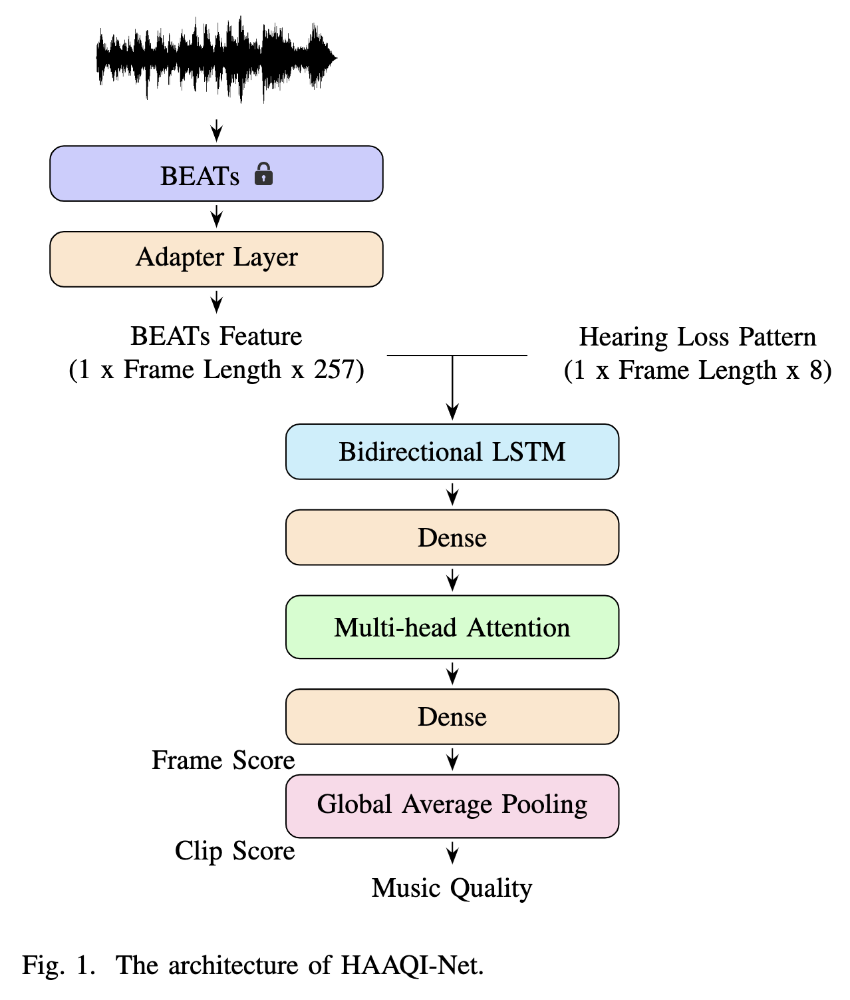
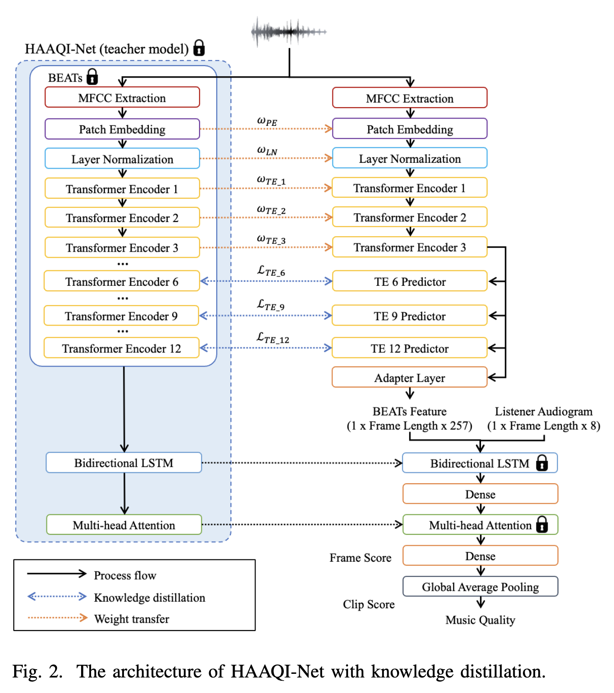

# HAAQI-Net

HAAQI-Net is a Non-intrusive Neural Music Audio Quality Assessment Model designed for Hearing Aids. This repository contains the source code, datasets, and pretrained models used in our research.

## Table of Contents
- [Introduction](#introduction)
- [Features](#features)
- [Installation](#installation)
- [Usage](#usage)
- [Datasets](#datasets)
- [Model Architecture](#model-architecture)
- [Results](#results)
<!-- - [References](#references) -->

## Introduction
Welcome to **HAAQI-Net**, a non-intrusive, deep learning-based model designed for music audio quality assessment tailored for hearing aid users. Traditional methods, such as the Hearing Aid Audio Quality Index (HAAQI), require intrusive reference signal comparisons, limiting their accessibility and computational efficiency. HAAQI-Net overcomes these limitations by providing a more accessible and efficient alternative.

Built on a Bidirectional Long Short-Term Memory (BLSTM) architecture with attention mechanisms, HAAQI-Net utilizes features extracted from the pre-trained BEATs model. This enables the model to predict HAAQI scores directly from music audio clips and hearing loss patterns, without the need for reference signals.

## Features:
1. **Non-Intrusive**: Unlike traditional methods, HAAQI-Net predicts audio quality scores directly from the input signals without requiring clean reference signals, making it more practical for real-world applications.

2. **Computationally Efficient**: Designed with a simple neural network architecture, HAAQI-Net significantly reduces inference time, allowing quality predictions to be computed in linear time. This efficiency is especially beneficial for resource-constrained environments.

3. **Differentiable**: As a fully differentiable neural network, HAAQI-Net can be seamlessly integrated into the loss function of other deep learning models. This allows it to be used for training upstream tasks, enhancing the overall performance of related models.

4. **High Accuracy**: Achieves strong performance metrics, including a Linear Correlation Coefficient (LCC) of 0.9368, a Spearman's Rank Correlation Coefficient (SRCC) of 0.9486, and a Mean Squared Error (MSE) of 0.0064.

5. **Knowledge Distillation**: By applying a knowledge distillation strategy, HAAQI-Net reduces its parameters by 75.85% and inference time by 96.46%, maintaining robust performance even with a significantly lighter model.

6. **Subjective Score Prediction**: Adapted to predict subjective human scores, such as the Mean Opinion Score (MOS), with fine-tuning, providing a comprehensive assessment of audio quality.

7. **Robustness to SPL Variations**: Demonstrates consistent performance across different Sound Pressure Level (SPL) conditions, achieving optimal results at a reference SPL of 65 dB.

## Installation
Clone this repository and install the required dependencies:
```bash
git clone https://github.com/dyahayumgw/HAAQI-Net.git
cd HAAQI-Net
conda env create -f environment.yml
```

## Usage 

### BEATs Model
For the BEATs model, you can download it from [BEATs](https://github.com/microsoft/unilm/tree/master/beats). We specifically use the BEATs_iter3+ (AS2M) version.

### Training
To train the model, run:
```bash
python src/train.py --config configs/train_config.yaml
```

### Testing
To evaluate the model, run:
```bash
# Test with zero hearing loss
python test.py --audio path/to/audio.wav --hl "[0, 0, 0, 0, 0, 0, 0, 0]"

# Test with hearing loss pattern
python test.py --audio path/to/audio.wav --hl "[20, 30, 40, 50, 60, 70, 70, 70]"

# Use specific model and config
python test.py --audio path/to/audio.wav --hl "[0, 0, 0, 0, 0, 0, 0, 0]" \
               --model path/to/model.pth --config path/to/config.yaml
```

## Datasets
The datasets used for training and evaluation are provided in this link: [dataset](https://t.ly/vLv29).

## Model Architecture

### HAAQI-Net
Below is the architecture diagram of HAAQI-Net:



### HAAQI-Net with Knowledge-Distillation
The diagram below illustrates the HAAQI-Net model integrated with knowledge-distillation:



### Results

### HAAQI-Net
Below is the architecture diagram of HAAQI-Net:


### HAAQI-Net with Knowledge-Distillation
The diagram below illustrates the HAAQI-Net model integrated with knowledge-distillation:


For more details and evaluation results, please check out our [HAAQI-Net Paper](https://arxiv.org/abs/2401.01145).
